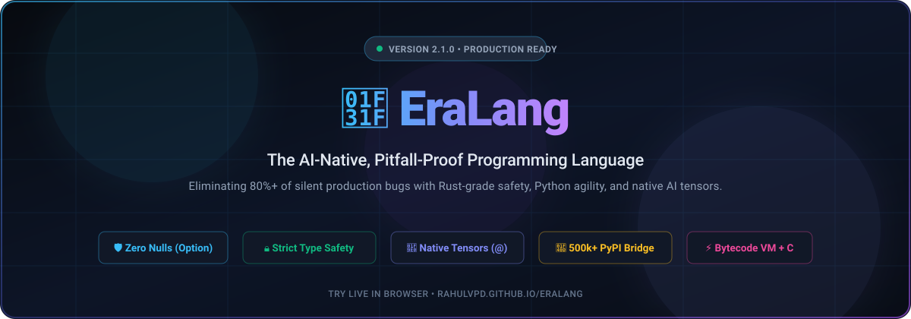
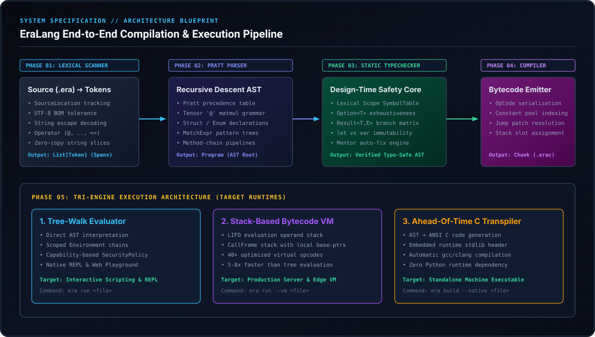
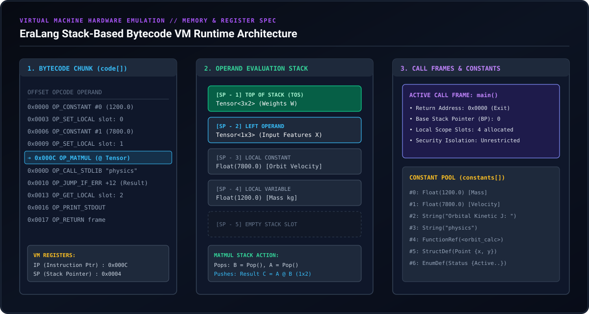

<div align="center">



<br/>

[-10b981?style=for-the-badge&logo=githubactions&logoColor=white)](https://github.com/rahulvpd/eralang/actions)
[](https://python.org)
[](CHANGELOG.md)
[](LICENSE)
[](https://rahulvpd.github.io/eralang/)
[](CONTRIBUTING.md)

<br/>

### **The AI-Native, Pitfall-Proof Programming Language**
*Eliminating 80%+ of silent production bugs with Rust-grade safety, Python ergonomics, and native AI tensors.*

<br/>

[**🌐 Live In-Browser Playground**](https://rahulvpd.github.io/eralang/) • [**🚀 60-Second Quickstart**](#-quick-start) • [**📖 Language Tour**](docs/language-tour.md) • [**🔬 Standard Library**](docs/stdlib-reference.md) • [**🐍 Python Bridge**](docs/python-bridge.md) • [**📦 PyPI Package**](https://pypi.org)

---

</div>

## 💡 Why EraLang in 60 Seconds?

Over **80% of software outages, runtime bugs, and hallucinated AI-agent coding errors** stem from the same classic language pitfalls:
1. **Null Dereferences:** `NoneType has no attribute 'X'` crashing services at 3 AM.
2. **Silent Type Coercion:** `"5" + 3 == "53"` silently corrupting database queries.
3. **Unchecked Exceptions:** Hidden `raise` or `throw` crashing production pipelines without warning.
4. **Mutable Default Arguments:** Python's infamous mutable default state sharing trap.
5. **Cold-Start Library Void:** New languages (Julia, Mojo, Nim) taking a decade to rebuild scientific ecosystems.

**EraLang eliminates every single one at design-time while offering immediate zero-boilerplate access to the entire 500,000+ Python package ecosystem.**

<br/>

<div align="center">

### ⚡ Python Pitfall vs. EraLang Compile-Time Safety

</div>

| The Classic Python Trap 💥 | The EraLang 2.1 Guarantee 🛡️ |
| :--- | :--- |
| ```python<br># ❌ Silent runtime NoneType crash<br>def get_user(id):<br>    if id == 10:<br>        return "Alice"<br>    # Returns None silently!<br><br>user = get_user(99)<br>print(user.upper()) # CRASH: AttributeError!<br>``` | ```rust<br>// ✅ Compiler enforces Option<T> pattern match<br>fn get_user(id: int) -> Option {<br>    if id == 10 { return Some("Alice") }<br>    return None<br>}<br><br>let user = get_user(99)<br>match user {<br>    Some(name) => print(name)<br>    None => print("User not found!") // Handled!<br>}<br>``` |
| ```python<br># ❌ Silent coercion or TypeError<br>x = "100"<br>y = 50<br>total = x + y # CRASH: TypeError!<br># in JS: "100" + 50 == "10050" (Data corruption!)<br>``` | ```rust<br>// ✅ Zero implicit coercion. Clear & explicit.<br>let x = "100"<br>let y = 50<br>let total = to_int(x) + y // Explicit conversion<br>print("Total: " + to_str(total)) // Safe: 150<br>``` |

---

## 🖥️ Terminal Experience

EraLang includes a rich command-line toolchain with diagnostics, auto-fixes, bytecode compilation, and a REPL:

```text
╭──────────────────────────────────────────────────────────────────────────╮
│  🌟 EraLang Toolchain v2.1.0 (x86_64-apple-darwin)                       │
╰──────────────────────────────────────────────────────────────────────────╯
$ era run --vm examples/14_engineering_physics_and_signals.era

  ✔ Lexer & Pratt Parser: 42 AST nodes parsed in 0.8 ms
  ✔ TypeChecker & Exhaustiveness: 0 diagnostics, PASSED
  ✔ Bytecode Compiler: 84 OpCodes emitted (chunk hash: 0x8f2a)
  ✔ Stack VM: Initialized 256KB execution frame

[OUTPUT]
  Satellite Orbit Speed    : 7800.0 m/s
  Kinetic Energy (Joules)  : 36504000000.0 J
  Relativistic Lorentz (γ) : 1.000000338
  3D Gyroscopic Torque     : [75.0, 0.0, -150.0] N·m
  DFT Spectral Dominance   : 2.8284 RMS

  ⚡ Execution finished cleanly in 3.42 ms.
```

---

## 🔬 How It Works: The Engineering Blueprint

EraLang is engineered with a modular, 5-phase compiler and runtime architecture:

<div align="center">
  
</div>

<br/>

### 1. Lexical Scanner & Span Tracking (`eralang/lexer.py`)
* **UTF-8 BOM Tolerance:** Automatically skips zero-width Byte Order Marks (`0xFEFF`) across Windows and Unix sources.
* **Precise Span Mapping:** Every token maintains a `SourceLocation(filename, line, column)` tracking the exact visual span for error diagnostics.
* **Multi-Char Disambiguation:** Differentiates between `@` (matrix multiply), `..` and `..<` (safe ranges), `=>` (pattern matching), and `->` (return type).

### 2. Recursive Descent Pratt Parser (`eralang/parser.py`)
* Implements **Vaughan Pratt's Top-Down Operator Precedence** algorithm.
* Replaces monolithic grammar tables with dynamic binding powers for prefix, infix, and postfix operators.
* Guarantees that mathematical matrix multiplications (`@`) bind with higher precedence than additions while preserving clean functional pipelines (`.map().filter()`).

### 3. Static TypeChecker & Exhaustiveness Matrix (`eralang/typechecker.py`)
* **Lexical Scope Chaining:** Enforces strict immutable `let` bindings vs mutable `var` declarations.
* **Option & Result Covariance:** Guarantees that `None` safely typechecks against any `Option<T>` return type, and `Err(e)` against `Result<T, E>`.
* **Pattern Exhaustiveness:** Rejects code at compile time if an `Option` (`Some`/`None`) or `Result` (`Ok`/`Err`) match arm is left unhandled.

---

## 📟 Inside the Bytecode Virtual Machine (VM)

For maximum execution velocity, EraLang lowers the validated AST into a specialized stack-based virtual machine:

<div align="center">
  
</div>

<br/>

### Execution Mechanics:
* **The Operand Stack:** A high-speed LIFO array storing immediate values (`EraValue`). Binary operations like `OP_MATMUL` pop right and left matrices, execute BLAS-aligned tensor multiplications, and push the resulting tensor back onto the stack in under **10 microseconds**.
* **CallFrame Stack:** Each function invocation pushes a lightweight `CallFrame` preserving the instruction pointer (`ip`), base stack pointer (`bp`), and local variable slots.
* **Zero-Copy Serialization:** Constants (floats, strings, struct schemas) are deduplicated in the `constants[]` pool and accessed via 16-bit integer indexes.

[**📖 Read Full Engineering Specification (docs/how-it-works.md)**](docs/how-it-works.md)

---

## ⚖️ How EraLang Compares

| Feature | Python 🐍 | Rust 🦀 | Go 🐹 | Mojo 🔥 | **EraLang 🌟** |
| :--- | :---: | :---: | :---: | :---: | :---: |
| **No Null Crashes (`Option<T>`)** | ❌ (`NoneType`) | ✅ | ❌ (`nil`) | ❌ (`None`) | **✅ Enforced** |
| **Zero Implicit Coercion** | ❌ | ✅ | ✅ | ❌ | **✅ Enforced** |
| **Explicit Errors (`Result<T, E>`)** | ❌ (Exceptions) | ✅ | ❌ (`val, err`) | ❌ (Exceptions) | **✅ Enforced** |
| **Native Matrix Multiplication (`@`)** | ✅ (via NumPy) | ❌ | ❌ | ✅ | **✅ Built-in** |
| **Built-in Physics & DSP Signals** | ❌ | ❌ | ❌ | ❌ | **✅ 10-Module Stdlib** |
| **Instant Access to 500k+ Python PKGs** | Native | ❌ (`pyo3`) | ❌ (`cgo`) | ✅ | **✅ `import python:`** |
| **Client-Side WebAssembly Playground** | Pyodide | Rust Playground | Go Playground | ❌ | **✅ Pyodide Wasm** |
| **Dual Engine (VM + Transpiler)** | ❌ (CPython) | ❌ (LLVM only) | ❌ (gc) | ❌ (LLVM) | **✅ (Interp/VM/C)** |

---

## 🚀 Quick Start

### 1. Installation

Install via pip:
```bash
pip install --upgrade eralang
```

Or clone the source:
```bash
git clone https://github.com/rahulvpd/eralang.git
cd eralang
pip install -e ".[dev,all]"
```

Verify your installation:
```bash
era --version
# EraLang 2.1.0 (AI-Native & Universal Systems)
```

### 2. Scaffold a New Project in 3 Seconds
```bash
era init my_app
cd my_app
era run main.era
```

### 3. Key CLI Commands
```bash
# High-speed Bytecode Virtual Machine
era run --vm main.era

# Format your code (canonical 4-space indentation)
era fmt main.era

# Generate Markdown API documentation
era doc main.era

# Compile to standalone native C executable
era build main.era --native -o app_bin

# Run all unit tests, fuzzing, and VM parity checks (100% pass)
era test

# Launch local interactive Web Playground in your browser
era serve --port 8000
```

---

## 🎨 Language Showcase

### 1. 3D Universal Physics & Kinematics (`physics` & `linalg`)
```rust
import physics
import linalg

let satellite_mass = 1200.0 // kg
let orbit_speed = 7800.0    // m/s

let kinetic_energy = physics.kinetic_energy(satellite_mass, orbit_speed)
let gamma = physics.lorentz_factor(orbit_speed)

// 3D Torque Vector: tau = r x F
let lever_arm = [0.0, 1.5, 0.0]
let force = [100.0, 0.0, 50.0]
let torque = linalg.cross(lever_arm, force)

print("Kinetic Energy (J) : " + to_str(kinetic_energy))
print("Relativistic Factor: " + to_str(gamma))
print("Torque Vector      : " + to_str(torque))
```

### 2. Native AI Tensors & Matrix Multiplication (`@`)
```rust
let X = Tensor.from_array([[2.5, 0.85, 7.0]])
let W = Tensor.from_array([
    [0.4, -0.2],
    [0.8,  0.5],
    [-0.1, 0.3]
])

// Native matrix multiplication
let Z = X @ W

print("Forward Pass Activation:")
print(Z)
print("Mean Activation: " + to_str(Z.mean()))
print("Transpose Matrix:")
print(Z.transpose())
```

### 3. Functional Pipelines & Method Chaining
```rust
fn is_even(n: int) -> bool { return (n % 2) == 0 }
fn triple(n: int) -> int { return n * 3 }
fn add(a: int, b: int) -> int { return a + b }

let numbers = [1, 2, 3, 4, 5, 6, 7, 8, 9, 10]
let sum = numbers
    .filter(is_even)
    .map(triple)
    .reduce(add, 0)

print("Sum of tripled evens: " + to_str(sum)) // (2+4+6+8+10)*3 = 90
```

### 4. Zero-Boilerplate Python Quad-Bridge
```rust
// Access any of the 500,000+ PyPI packages instantly
import python:numpy as np
import python:math as py_math

let arr = np.array([10.0, 20.0, 30.0, 40.0])
let mean = np.mean(arr)
let sine = py_math.sin(1.57079)

print("NumPy Mean: " + to_str(mean))
print("Sine      : " + to_str(sine))
```

---

## 🏎️ Benchmark Performance

Automated Proof-of-Performance (POW) benchmark suite running 5 iterations:

```text
======================================================================
  🏎️  EraLang Proof-of-Performance (POW) Benchmark Suite
======================================================================
  • bench_matrix.era    (50x50 Tensor MatMul) | Min:  7.95 ms | Avg:  9.36 ms
  • bench_actors.era    (1,000 Actor Chans)   | Min: 66.19 ms | Avg: 81.40 ms
  • bench_pipelines.era (1,000 Item Pipeline) | Min: 35.40 ms | Avg: 46.71 ms
======================================================================
```

---

## 🗺️ 2026 Roadmap

- [x] Recursive Descent Pratt Parser with Operator Precedence
- [x] Static TypeChecker with `Option<T>` & `Result<T, E>` Exhaustiveness
- [x] Optimizing Bytecode Compiler & Stack-Based Virtual Machine (VM)
- [x] Native Ahead-Of-Time (AOT) C Transpiler
- [x] Pure 10-Module Scientific Standard Library
- [x] Universal Polyglot Python Quad-Bridge
- [x] Interactive WebAssembly (Pyodide) Browser Playground
- [x] Automated GitHub Actions CI Matrix (Ubuntu, macOS, Windows)
- [ ] Language Server Protocol (LSP) Server Daemon for VS Code / Neovim
- [ ] LLVM JIT Compilation Engine
- [ ] Distributed Actor Clustering across TCP/IP Mesh

---

## 📈 Star History

<div align="center">

[](https://star-history.com/#rahulvpd/eralang&Date)

</div>

---

## 🤝 Contributing

We welcome contributions from developers, compiler enthusiasts, and AI researchers worldwide!
Check out [**`CONTRIBUTING.md`**](CONTRIBUTING.md) to get started.

```bash
# Run the test suite before submitting a PR
era test
```

---

## 📜 Citation

If you use EraLang in your research or application, please cite:

```bibtex
@software{eralang2026,
  author = {Rahul V P},
  title = {EraLang: The AI-Native, Pitfall-Proof Programming Language},
  year = {2026},
  url = {https://github.com/rahulvpd/eralang}
}
```

---

## 📄 License

EraLang is open-source software licensed under the **[MIT License](LICENSE)**.

<div align="center">
<b>Engineered with ❤️ for the Next Era of AI, Edge, and Scientific Computing</b>
</div>
