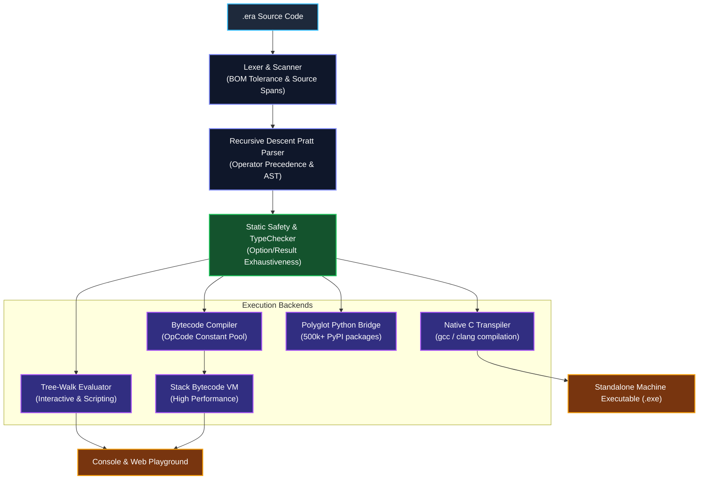

<div align="center">

# 🌟 EraLang
### **The AI-Native, Pitfall-Proof Programming Language**
*Zero Nulls • Zero Coercion • Native Tensors (`@`) • Universal Python Polyglot Bridge • Optimizing Bytecode VM*

[-brightgreen?style=for-the-badge&logo=githubactions&logoColor=white)](https://github.com/rahulvpd/eralang/actions)
[](https://python.org)
[](CHANGELOG.md)
[](LICENSE)
[](https://rahulvpd.github.io/eralang/)

[**Interactive Web Playground**](https://rahulvpd.github.io/eralang/) • [**Language Tour**](docs/language-tour.md) • [**Standard Library**](docs/stdlib-reference.md) • [**Python Bridge**](docs/python-bridge.md) • [**Launch Playbook**](LAUNCH_PLAYBOOK.md)

---
</div>

## 📌 Executive Overview

**EraLang** is a modern general-purpose programming language engineered to eliminate the most common, silent, and catastrophic software pitfalls at design-time while providing **first-class AI & tensor primitives**, **native Structs & Enums**, **functional data pipelines**, a **pure 10-module Scientific Standard Library**, a **high-performance Bytecode Virtual Machine**, an **ahead-of-time C Transpiler**, and **zero-boilerplate access to the entire Python ecosystem**.

Over 80% of software bugs in production and AI-generated code originate from classic language flaws:
- Null/None dereferences (`NoneType` attribute crashes)
- Silent type coercion bugs (e.g. `"5" + 3 == "53"`)
- Unhandled runtime exceptions (`raise`/`throw` caught too late)
- Mutable default parameter leaks (Python's default argument trap)

EraLang completely eliminates these flaws at compilation and design time.

---

## 🏛️ System Architecture



---

## 🛡️ Core Safety Pillars & Bug Elimination

| Classic Pitfall | Root Cause in Other Languages | EraLang 2.1 Solution |
| :--- | :--- | :--- |
| **Null / None Crashes** | Primitive unchecked `null`/`None` everywhere | **No `null`**. First-class `Option<T>` (`Some(v)` / `None`). Direct unchecked access is blocked. |
| **Silent Type Coercion** | Implicit coercion (e.g. `"5" + 3 == "53"`) | **Zero implicit coercion**. Strict typing with explicit conversions (`to_str`, `to_int`). |
| **Unchecked Exceptions** | Unannounced runtime `raise` or `throw` | **No runtime exceptions**. Explicit `Result<T, E>` (`Ok(v)` / `Err(e)`). Pattern match forced. |
| **Off-by-One / Bounds Traps** | Out-of-bounds crashes (`IndexError`) | Safe half-open ranges `0..<n`. Indexing returns `Option<T>` with `.unwrap_or()`. |
| **Mutable Default Trap** | Defaults instantiated once at definition (Python trap) | **Fresh default instantiation** evaluated dynamically on each invocation. |
| **Missing Edge Cases** | Incomplete conditionals and missing switch cases | **Compiler-enforced exhaustive pattern matching** on all enum and option variants. |
| **Ad-Hoc Dictionaries** | Missing struct schema enforcement | **Native Structs & Enums** with field-level typing and pattern matching. |
| **Procedural Boilerplate** | Clunky procedural loops for data transformations | **Functional Method Chaining** (`.map()`, `.filter()`, `.reduce()`). |
| **Tensor Complexity** | Heavy external library dependencies for basic matrix math | **Built-in Tensors (`@`), Linear Algebra (`linalg`), DSP (`signal`), & Physics (`physics`)**. |
| **Ecosystem Cold-Start** | New languages lack libraries | **Universal Polyglot Bridge** (`import python:torch as torch`, `import python:numpy as np`). |

---

## ⚖️ Feature Comparison: EraLang vs Other Languages

| Feature | Python | Rust | Go | Mojo | **EraLang 2.1** |
| :--- | :---: | :---: | :---: | :---: | :---: |
| **No Null Pointers (`Option<T>`)** | ❌ (None) | ✅ | ❌ (nil) | ❌ (None) | **✅ (Enforced)** |
| **No Silent Type Coercion** | ❌ | ✅ | ✅ | ❌ | **✅** |
| **Explicit Errors (`Result<T, E>`)** | ❌ (Exceptions) | ✅ | ❌ (`val, err`) | ❌ (Exceptions) | **✅** |
| **Native Matrix Operator (`@`)** | ✅ (via NumPy) | ❌ | ❌ | ✅ | **✅ (Built-in)** |
| **Instant Python Interop** | Native | ❌ (pyo3) | ❌ (cgo) | ✅ | **✅ (`import python:`)** |
| **In-Browser Playground** | Pyodide | Rust Playground | Go Playground | Cloud | **✅ (Pyodide Wasm)** |
| **Multi-Backend (Interp/VM/C)** | CPython | LLVM | gc | LLVM | **✅ (Eval + VM + C)** |

---

## 🚀 Quick Start

### 1. Installation

```bash
# Clone the repository
git clone https://github.com/rahulvpd/eralang.git
cd eralang

# Install in editable mode
pip install -e .
```

### 2. Run a Script

```bash
# Tree-walk interpreter
era run examples/01_zero_nulls.era

# High-performance Bytecode VM
era run --vm examples/14_engineering_physics_and_signals.era

# Transpile to standalone native machine binary
era build examples/01_zero_nulls.era --native -o my_binary
```

### 3. Toolchain Utilities

```bash
# Format source code (canonical 4-space indentation)
era fmt examples/01_zero_nulls.era

# Generate Markdown API documentation
era doc examples/09_structs_and_enums.era

# Scaffold a new project with era.toml
era init my_app

# Run all unit tests, fuzzing tests, and VM parity tests
era test

# Launch local interactive Web Playground
era serve --port 8000
```

---

## 📖 Language Showcase

### 1. Zero Nulls & Safe Options
```rust
fn find_user(id: int) -> Option {
    if id == 101 {
        return Some("Alice Walker")
    }
    return None
}

let user = find_user(101)
match user {
    Some(name) => print("Found user: " + name)
    None => print("User not found!")
}

let fallback = find_user(999).unwrap_or("Guest User")
print("Fallback user: " + fallback)
```

### 2. Native Tensors & Matrix Multiplication (`@`)
```rust
let A = Tensor.from_array([[1.0, 2.0], [3.0, 4.0]])
let B = Tensor.from_array([[5.0, 6.0], [7.0, 8.0]])
let C = A @ B

print("Matrix Product A @ B:")
print(C)
print("Mean: " + to_str(C.mean()))
print("Transpose: ")
print(C.transpose())
```

### 3. Universal Physics & Kinematics (`physics` & `linalg`)
```rust
import physics
import linalg

let satellite_mass = 1200.0 // kg
let orbit_speed = 7800.0    // m/s

let kinetic_energy = physics.kinetic_energy(satellite_mass, orbit_speed)
let gamma = physics.lorentz_factor(orbit_speed)

// 3D Torque Vector: tau = r x F
let lever_arm = [0.0, 1.5, 0.0]
let force = [100.0, 0.0, 50.0]
let torque = linalg.cross(lever_arm, force)

print("Kinetic Energy (J): " + to_str(kinetic_energy))
print("Torque Vector     : " + to_str(torque))
```

### 4. Functional Data Pipelines
```rust
fn is_even(n: int) -> bool { return (n % 2) == 0 }
fn double_it(n: int) -> int { return n * 2 }
fn add(a: int, b: int) -> int { return a + b }

let numbers = [1, 2, 3, 4, 5, 6, 7, 8, 9, 10]
let sum = numbers
    .filter(is_even)
    .map(double_it)
    .reduce(add, 0)

print("Sum of doubled evens: " + to_str(sum)) // 60
```

---

## 📁 Repository Structure

```
eralang/
├── .github/
│   ├── workflows/
│   │   ├── ci.yml                 # Matrix testing (Python 3.9-3.12 on Linux, macOS, Windows)
│   │   ├── release.yml            # Automated PyPI packaging & publishing
│   │   └── pages.yml              # Automated GitHub Pages playground deployment
│   ├── ISSUE_TEMPLATE/            # Structured bug and feature report templates
│   ├── PULL_REQUEST_TEMPLATE.md   # Pull request guidelines
│   └── dependabot.yml             # Weekly dependency updater
├── .devcontainer/                 # 1-click cloud devcontainer for GitHub Codespaces
├── benchmarks/                    # Proof-of-Performance (POW) benchmark scripts
├── docs/                          # Full documentation suite
│   ├── index.md                   # Overview & safety guarantees
│   ├── getting-started.md         # Installation and quickstart
│   ├── language-tour.md           # Syntax, structs, enums, options, results
│   ├── stdlib-reference.md        # Reference for all 10 standard library modules
│   ├── python-bridge.md           # Universal Python polyglot bridge guide
│   └── architecture.md            # Pratt parser, bytecode VM, and C transpiler internals
├── editors/
│   └── vscode/                    # VS Code / Cursor language extension & TextMate syntax
├── eralang/                       # Core compiler, runtime & standard library
│   ├── lexer.py                   # Lexical scanner & span tracking
│   ├── parser.py                  # Recursive descent Pratt parser
│   ├── typechecker.py             # Static safety, exhaustiveness & type verification
│   ├── evaluator.py               # Tree-walk interpreter runtime
│   ├── compiler.py                # Optimizing bytecode compiler
│   ├── vm.py                      # Stack-based Bytecode Virtual Machine
│   ├── c_transpiler.py            # Ahead-of-time C transpiler & binary compiler
│   ├── stdlib.py                  # 10-module pure scientific standard library
│   ├── bridge_python.py           # Universal Python ecosystem polyglot bridge
│   └── cli.py                     # Unified CLI toolchain (run, vm, fmt, doc, serve, test, bench)
├── examples/                      # 16 executable EraLang example scripts
├── tests/                         # Unit, fuzzing, concurrency & VM parity test suites
├── web/                           # In-browser WebAssembly playground (Pyodide)
├── Dockerfile                     # Multi-stage container deployment
├── pyproject.toml                 # Modern PEP 621 packaging & tool configs
├── CHANGELOG.md                   # Version history & release notes
├── CONTRIBUTING.md                # Developer contribution guide
├── LICENSE                        # MIT License
└── README.md                      # Documentation
```

---

## 📜 License

This project is licensed under the **MIT License** - see the [LICENSE](LICENSE) file for details.
